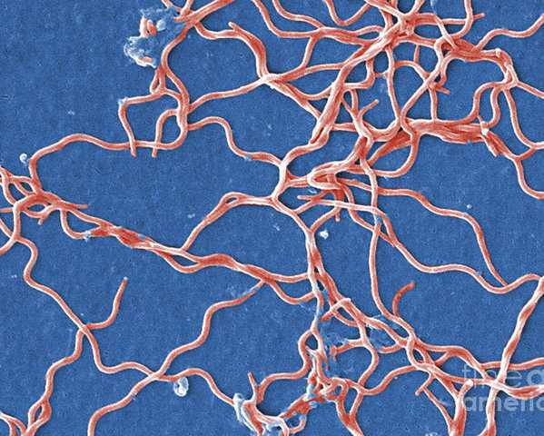

# Read csv file:
```{r}
sequences <- read.csv("Sequences.csv")
# Change column name to make easier to read
colnames(sequences) <- c("seq.number","seq.bases")
```

# Get purely the base pairs of the sequences and store them as variables:
## HQ433692.1
```{r}
seq1 <- gsub("[^AGCT]","", sequences$seq.bases[1])
print(seq1)
```
## HQ433694.1
```{r}
seq2 <- gsub("[^AGCT]","", sequences$seq.bases[2])
print(seq2)
```
## HQ433691.1
```{r}
seq3 <- gsub("[^AGCT]","", sequences$seq.bases[3])
print(seq3)
```

# Count the number of each nucleotide for each sequence:
## HQ433692.1
```{r}
seq1char <- strsplit(seq1, "")[[1]]
sequences$totalG[1] <- sum(grepl("G", seq1char))
sequences$totalA[1] <- sum(grepl("A", seq1char))
sequences$totalT[1] <- sum(grepl("T", seq1char))
sequences$totalC[1] <- sum(grepl("C", seq1char))
```
HQ433694.1
```{r}
seq2char <- strsplit(seq2, "")[[1]]
sequences$totalG[2] <- sum(grepl("G", seq2char))
sequences$totalA[2] <- sum(grepl("A", seq2char))
sequences$totalT[2] <- sum(grepl("T", seq2char))
sequences$totalC[2] <- sum(grepl("C", seq2char))
```
HQ433691.1
```{r}
seq3char <- strsplit(seq3, "")[[1]]
sequences$totalG[3] <- sum(grepl("G", seq3char))
sequences$totalA[3] <- sum(grepl("A", seq3char))
sequences$totalT[3] <- sum(grepl("T", seq3char))
sequences$totalC[3] <- sum(grepl("C", seq3char))
```

# Make a table of the number of each nucleotide for each sequence:

Base pair content per 16S sequence
----------
Sequence ID|Total Gs|Total As|Total Ts|Total Cs
----|----|----|----|----
HQ433692.1|131|155|114|82
HQ433694.1|131|156|114|82
HQ433691.1|132|155|115|81

# Image of *Borrelia burgdorferi*



# Take a look at the [Wikipedia page](https://en.wikipedia.org/wiki/Borrelia_burgdorferi)

# Calculate GC content:
HQ433692.1
```{r}
sequences$GCcontent[1] <- (sequences$totalG[1] + sequences$totalC[1])/length(seq1char)
```
HQ433694.1
```{r}
sequences$GCcontent[2] <- (sequences$totalG[2] + sequences$totalC[2])/length(seq1char)
```
HQ433691.1
```{r}
sequences$GCcontent[3] <- (sequences$totalG[3] + sequences$totalC[3])/length(seq1char)
```

# Display the GC content per sequence in a table:

GC content per 16s sequence
--------
Sequence ID|GC Content
-----|-------
HQ433692.1|44.19%
HQ433694.1|44.19%
HQ433691.1|44.19%

# Load GC content data from BIOL432 website
```{r}
GCdata <- read.csv("https://colauttilab.github.io/Files/GC_content.csv")
# Check data
head(GCdata)
tail(GCdata)
dim(GCdata)
summary(GCdata)
```

# Add %GC content to the data.frame
```{r}
GCdata$GC <- GCdata$G + GCdata$C
head(GCdata)
```

# Plot the GC content
```{r}
library(ggplot2)
library(ggthemes)
scatterPlot <- ggplot(GCdata, aes(x = ID, y = GC)) +
  geom_point(aes(colour = Species), size = I(3)) +
  scale_x_discrete(name = "Individual") +
  theme(axis.ticks = element_blank(), axis.text.x = element_blank(),
        axis.line = element_line()) +
  ylab("GC content (%)")
scatterPlot
```

Figure 1. The relation between individual and GC base pair content. Colour distinguishes the three different species provided. There are 336 individuals from species A, 346 from B, and 318 from C.